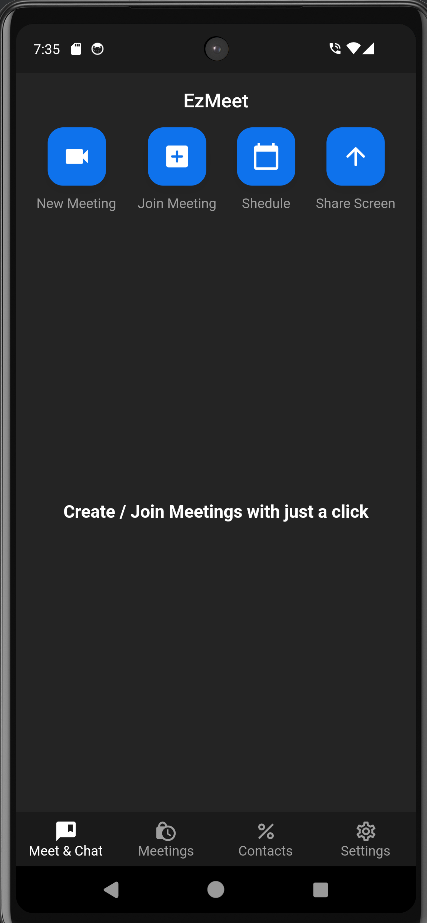
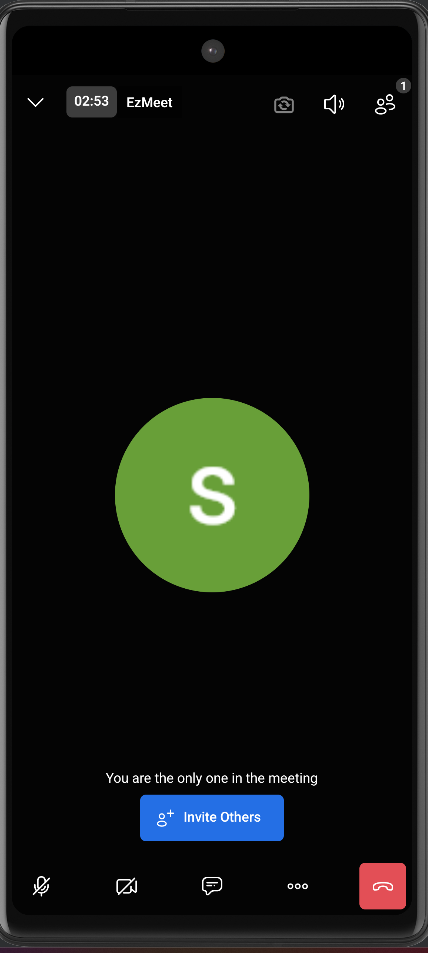

# Meeting Application

A meeting application built using Flutter

## Tech Stack

Flutter | Dart | Firebase

## Features

- A meeting application similar to zoom
- Integrated Jitsi meet package for video calls
- Implemented user authentication through Google Sign-in using Firebase

## Screen Shots

<table>
   <tr>
    <td align="center">Home Screen</td>
    <td align="center">Meeting Screen</td>
  </tr>
  <tr>
    <td align="center"></td>
    <td align="center"></td>
  </tr>
</table>

## Note
To run this app:
- Configure Firebase
- Carefully read jitsi_meet documentation if facing any issue.
